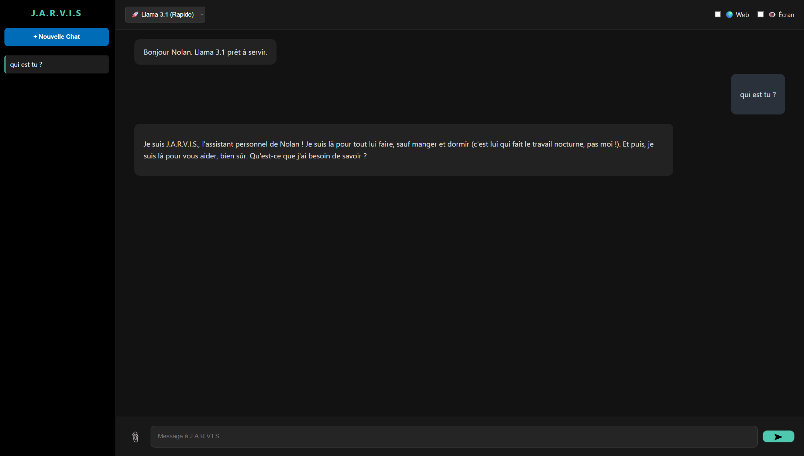

\# 🤖 J.A.R.V.I.S - Local AI Station

<div align="center">
  
</div>


Une station d'Intelligence Artificielle multimodale, souveraine et autonome, conçue pour tourner 100% en local sur du matériel grand public (GPU AMD/NVIDIA).


\## 🚀 Fonctionnalités


Ce projet n'est pas un simple chatbot. C'est un assistant système complet capable de :


\* \*\*🧠 Réfléchir :\*\* Utilise des LLM locaux (Llama 3, Mixtral) via Ollama.

\* \*\*🌍 S'informer :\*\* Connecté à Google News en temps réel pour l'actualité.

\* \*\*👁️ Voir :\*\* Analyse l'écran de l'utilisateur ou des images via LLaVA (Computer Vision).

\* \*\*👋 Agir :\*\* Contrôle le PC (Lancement d'applis, Spotify/Deezer, Calculatrice...).

\* \*\*📚 Lire :\*\* Analyse et résume des documents PDF (RAG).

\* \*\*💾 Se souvenir :\*\* Gestion d'historique persistant via SQLite.


\## 🛠️ Stack Technique


\* \*\*Backend :\*\* Python, Flask

\* \*\*Frontend :\*\* HTML5, CSS3, JavaScript (Fetch API)

\* \*\*IA Engine :\*\* Ollama (Local Inference)

\* \*\*Vision :\*\* PyAutoGUI + LLaVA

\* \*\*Database :\*\* SQLite


\## 📦 Installation

### 💾 Prérequis Stockage (Important)

Ce projet utilise des modèles d'IA (LLM) qui doivent être téléchargés et stockés localement sur votre machine. Assurez-vous d'avoir suffisamment d'espace libre :

| Modèle | Taille approx. | Usage |
| :--- | :--- | :--- |
| **Llama 3.1 (8B)** | ~4.7 Go | Modèle rapide par défaut |
| **LLaVA** | ~4.5 Go | Vision (Analyse d'images) |
| **Mixtral (Optionnel)** | ~26.0 Go | Modèle complexe (Expert) |

> **💡 Recommandation :** Prévoyez au moins **40 Go d'espace libre** sur un **SSD** (fortement recommandé pour la vitesse de réponse).


1\. \*\*Prérequis :\*\* Avoir \[Ollama](https://ollama.com) installé.


2\. \*\*Cloner le repo :\*\*

&nbsp;  ```bash

&nbsp;  git clone \[https://github.com/TonPseudo/Jarvis-Local-AI.git](https://github.com/TonPseudo/Jarvis-Local-AI.git)

&nbsp;  cd Jarvis-Local-AI


3\. \*\*Installer les dépendances via le Bash en Administrateur :\*\*

&nbsp;  ```bash

&nbsp;  pip install -r requirements.txt


4\. \*\*Télécharger les modèles (dans le terminal) :\*\*

&nbsp;  ```bash

&nbsp;  ollama pull llama3.1

&nbsp;  ollama pull llava


5\. \*\* Lancer le serveur :\*\*


&nbsp;  python app.py

&nbsp;  Accédez à http://127.0.0.1:5000


👤 Auteur

Projet réalisé par Nolan.


